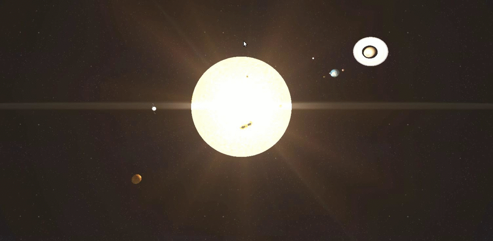

# Solar System in Threejs

This is a 3D Solar System JavaScript model created with [Threejs](https://threejs.org/).



## Usage
The easy way to use the 3D Solar System is importing dependencies and using plain JavaScript with RequireJS to use modules.

```html
<script type="text/javascript" src="../bower_components/underscore/underscore-min.js"></script>
<script type="text/javascript" src="../bower_components/jquery/dist/jquery.min.js"></script>

<script type="text/javascript" src="../bower_components/three.js/build/three.min.js"></script>
<script type="text/javascript" src="../bower_components/three.js/examples/js/controls/TrackballControls.js"></script>
<script type="text/javascript" src="../bower_components/three.js/examples/js/libs/stats.min.js"></script>
<script type="text/javascript" src="../bower_components/three.js/examples/js/libs/require.js"></script>

<script type="text/javascript" src="../dist/solar-system.min.js"></script>

<script>
  require(['solar-system'], function three(SolarSystem) {
    SolarSystem.init();
  });
</script>
```

We may also change default properties as follow.

```html
<script>
  require(['solar-system'], function three(SolarSystem) {
    SolarSystem.init( {
      width: '500',
      height: '500',
      'bodies-src': 'data/bodies.properties.json',
      'camera-src': 'data/camera.properties.json',
      'lights-src': 'data/lights.properties.json'
    });
  });
</script>
```

Check [demo](demo) folder to see some examples.

>Note that data properties could be change to create new System models. Here and example of planet Earth.

```json
{
  "name": "Earth",
  "type": "Planet",
  "radius": 1,
  "tilt": 23.17,
  "vRotation": 0.1,
  "map": "img/earth/earthmap1k.jpg",
  "bumpMap": "img/earth/earthbump1k.jpg",
  "specularMap": "img/earth/earthspec1k.jpg",
  "orbitProperties": {
    "round" : "Sun",
    "distance": 14.5,
    "speed": 0.2
  },
  "cloudsProperties": {
    "radius": 1.01,
    "opacity": 0.5,
    "transparent" : true,
    "depthWrite"  : false,
    "speed": 0.2,
    "map": "img/earth/earthcloudmap.jpg"
  }
}
```

**React**

We can also import the 3D Solar System as a [Reactjs](https://facebook.github.io/react/) component.

```html
<script type="text/javascript" src="../bower_components/react/react.js"></script>
<script type="text/javascript" src="../bower_components/react/react-dom.js"></script>

<script type="text/javascript" src="../bower_components/underscore/underscore-min.js"></script>
<script type="text/javascript" src="../bower_components/jquery/dist/jquery.min.js"></script>
<script type="text/javascript" src="../bower_components/three.js/build/three.min.js"></script>
<script type="text/javascript" src="../bower_components/three.js/examples/js/controls/TrackballControls.js"></script>
<script type="text/javascript" src="../bower_components/three.js/examples/js/libs/stats.min.js"></script>

<script type="text/javascript" src="../bower_components/three.js/examples/js/libs/require.js"></script>

<script type="text/javascript" src="../dist/solar-system.min.js"></script>

<div id="solar-system"
  width="500"
  height="500"
  bodies-src="data/bodies.properties.json"
  camera-src="data/camera.properties.json"
  lights-src="data/lights.properties.json">
</div>

<script async src="../dist/solar-system-react.js"></script>
```

**Polymer**

We can also import the 3D Solar System as a [Polymer](https://www.polymer-project.org/) component.


```html
<script type="text/javascript" src="../bower_components/underscore/underscore-min.js"></script>
<script type="text/javascript" src="../bower_components/jquery/dist/jquery.min.js"></script>
<script type="text/javascript" src="../bower_components/three.js/build/three.min.js"></script>
<script type="text/javascript" src="../bower_components/three.js/examples/js/controls/TrackballControls.js"></script>
<script type="text/javascript" src="../bower_components/three.js/examples/js/libs/stats.min.js"></script>
<script type="text/javascript" src="../bower_components/three.js/examples/js/libs/require.js"></script>

<script type="text/javascript" src="../dist/solar-system.min.js"></script>

<link rel="import" href="../bower_components/polymer/polymer.html">

<link rel="import" href="../dist/solar-system.htm">

<solar-system
  width="500"
  height="500"
  bodies-src="data/bodies.properties.json"
  camera-src="data/camera.properties.json"
  lights-src="data/lights.properties.json">
</solar-system>
```

## Development Guidelines

### Install

Install dependencies with `npm` and `bower` within project folder.

```sh
npm install
bower install
```

### Build

We use `grunt` as a task runner to build the project. So we suggest to install `grunt-cli` as a global dependency.

```sh
npm install -g grunt-cli
```

Then build the project with `grunt` as a global dependency inside project folder.

```sh
grunt build
```

However, we can also build project with `grunt` as a local dependecy inside project folder.

```sh
./node_modules/grunt-cli/bin/grunt build
```

Or, using a `npm` script.

```sh
npm run build
```

### Serve
We can build project on `serve` mode to check change immediately.

```sh
grunt serve
```

or

```sh
./node_modules/grunt-cli/bin/grunt serve
```

or

```sh
npm run serve
```

This throws a Web Server in `http://localhost:9000/` watching source files to check changes.

### Tests
We also use `grunt` to run tests. So, using `grunt` as global dependency.

```sh
grunt test
```

However, using `grunt` as a local dependency.

```sh
./node_modules/grunt-cli/bin/grunt test
```

Or, just using `npm` script.

```sh
npm test
```

It is also possible to run test on `watch` mode.

```sh
grunt test:watch
```

or

```sh
./node_modules/grunt-cli/bin/grunt test:watch
```

or

```sh
npm run test:watch
```
